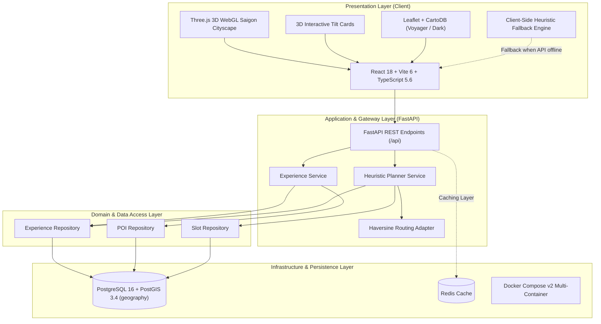

# Local Explorer AI - Technical Architecture Specification

## 1. Executive Summary

**Local Explorer AI** is an intelligent urban exploration and time-aware activity planning platform designed for Ho Chi Minh City. The system is engineered to solve the disconnect between static map representations and dynamic real-world availability.

The core principle of the architecture:
```text
POI (Point of Interest) ──> Experience (Activity) ──> Experience Slot (Time & Capacity) ──> Itinerary
```

---

## 2. High-Level Architecture Diagram



---

## 3. Decoupled 4-Tier Layer Specification

### 3.1 Presentation Layer (Frontend)
- **Framework**: React 18.3.1 + Vite 6.0.5 + TypeScript 5.6.3.
- **3D Graphics**: Three.js WebGL rendering an interactive topographic digital twin of Ho Chi Minh City with glowing neon architecture, an S-curved Saigon River, radar pulse pins, and mouse-driven parallax camera damping.
- **Styling**: Vanilla CSS Tokens + Tailwind CSS base utilities + Glassmorphism (`backdrop-filter: blur(20px)`), glowing accents and dynamic card hover tilts (`TiltCard3D`).
- **Mapping**: Leaflet with CartoDB high-resolution vector tiles (Voyager for Day, Dark Matter for Night), 3D custom animated marker pins and interactive popups.
- **Offline Resilience**: Built-in client-side Heuristic Mock Fallback inside `api/client.ts`. If backend is unavailable, the user can still test all planning features smoothly.

### 3.2 Application Layer (FastAPI Backend)
- **Framework**: Python 3.12+ with FastAPI 0.115.
- **Controllers**:
  - `/api/pois`: Geo-spatial queries for Points of Interest.
  - `/api/experiences`: Query experiences filtered by intent, time range, budget, and group size.
  - `/api/itineraries/plan`: Deterministic heuristic itinerary synthesis.
  - `/health`: Health status probe for container orchestration.
- **Validation**: Strict Pydantic v2 schemas for all requests and responses with UTC ISO 8601 timestamps.

### 3.3 Planner Service & Routing Engine
- **Algorithm**: Multi-objective heuristic optimization.
  - Prunes unavailable and out-of-budget candidate slots.
  - Evaluates intent weights and slot capacity scores.
  - Sequences stops by inserting transit buffer times calculated from a Haversine distance matrix.
- **Transparency**: Every recommendation includes reason codes (`INTENT_MATCH`, `WITHIN_BUDGET`, `SLOT_AVAILABLE`, `MOCK_ROUTING`) and flags unconfirmed slots with `tentative` status.

### 3.4 Persistence Layer (PostgreSQL + PostGIS)
- **Database**: PostgreSQL 16 with PostGIS 3.4 extension.
- **Geo-Spatial Column**: `pois.geom` of type `geography(POINT, 4326)` with GIST spatial indexing for sub-millisecond proximity queries.
- **ORM**: SQLAlchemy 2.0 with asynchronous engine and Alembic schema migrations.

---

## 4. End-to-End Itinerary Synthesis Flow

```text
User Submits Planning Request:
[Date, Time: 09:00 - 17:00, Group: 2, Budget: 1.5M VND, Intents: Food + Craft, Transport: Driving]
                         │
                         ▼
[FastAPI Gateway] Validates payload against Pydantic schema
                         │
                         ▼
[Experience Service] Queries Candidate Experiences & Active Slots from PostGIS
                         │
                         ▼
[Heuristic Planner]
  1. Filters slots overlapping the available time window.
  2. Calculates per-person price constraints: Price <= (Budget / Group_Size).
  3. Ranks candidates using intent affinity and category variety.
  4. Selects Top-N experiences and schedules chronological stops.
  5. Computes travel legs using Haversine Routing Adapter (adding travel minutes).
  6. Determines Feasibility Status ('feasible' vs 'tentative').
                         │
                         ▼
[Persistence Layer] Saves Itinerary entity and returns JSON Response with Reason Codes
                         │
                         ▼
[React 3D Client] Renders Interactive 3D Laser Timeline, 4 KPI Cards, and updates Vector Map
```

---

## 5. Security & Reliability

- **Envelope Pattern**: All error responses follow standard format `{ "error": { "code", "message", "details", "request_id" } }`.
- **CORS Protection**: Restricted origins configurable via environment variables.
- **Database Connection Pooling**: SQLAlchemy connection pool with pre-ping validation.
- **Zero Hallucination Guarantee**: No generative LLM is invoked during itinerary generation, ensuring 100% deterministic, reproducible travel plans.
