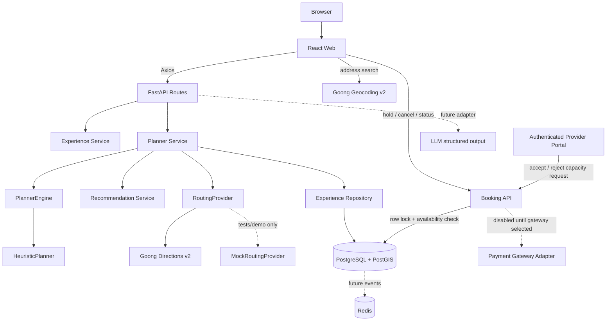

# Kiến trúc

## Thành phần

- **Web**: React + TypeScript + Vite; trang Explore, Planner, itinerary, provider portal, admin và About. Axios gom tại `src/api`, Leaflet chỉ nằm sau `MapAdapter`.
- **API**: FastAPI route nhận/kiểm tra request rồi ủy quyền cho service. Pydantic giữ contract và định dạng lỗi có request ID.
- **Service**: `ExperienceService`, `RecommendationService`, `PlannerService`, `ExplanationService`, `evidence_service`; Planner điều phối repository, kiểm tra nguồn/hạn, routing và engine.
- **Planner engine**: `PlannerEngine` là interface; `HeuristicPlanner` lựa slot khả thi sớm nhất rồi ưu tiên intent khi cùng giờ. Có thể thêm engine OR-Tools mà không đổi route contract.
- **Repository**: truy vấn SQLAlchemy cho catalog và slot, tách chi tiết persistence khỏi route.
- **Database**: PostgreSQL + PostGIS; tọa độ latitude/longitude phục vụ response và `pois.geom geography(POINT,4326)`/GIST phục vụ truy vấn không gian tương lai.
- **Routing/geocoding adapters**: `RoutingProvider` dùng `GoongDirectionsProvider` theo `ROUTING_PROVIDER=goong` (mặc định local/production), `GoongGeocodingProvider` cho địa chỉ người dùng nhập, và `MockRoutingProvider` chỉ để kiểm thử/chạy demo chủ động. Goong trả distance, duration và route geometry; cả nguồn, thời điểm tính, TTL cache và cờ `is_realtime=false` đi theo từng leg. Không có traffic ETA trực tiếp.
- **Redis**: được đưa vào Compose và health check; chưa có cache, queue hoặc event consumer.
- **Map adapter**: Leaflet + OpenStreetMap trong demo. Map SDK không giữ business logic.

## Dòng lập lịch

1. Request datetime phải có offset; planner chuẩn hóa thời điểm cho so sánh/lưu UTC.
2. Lọc slot trong khoảng chuyến đi, loại slot đã hủy/hết chỗ và loại `available_reported` nhỏ hơn quy mô nhóm.
3. Tính giá theo `price_basis`, loại trải nghiệm vượt ngân sách còn lại.
4. Geocode địa chỉ nhập thành các lựa chọn tọa độ có source/time/expiry; với mỗi ứng viên, lấy route estimate từ Goong cho leg đi và chặng về. Chỉ nhận slot bắt đầu sau ETA và lịch về trước deadline.
5. Engine chọn slot khả thi; lý do, mục đích được giữ/mất, tính bất định, nguồn/tuổi ETA và encoded route geometry được đưa vào response.
6. Với catalog thật, Planner chỉ dùng POI/experience đủ bằng chứng đang duyệt và slot có xác nhận chưa hết hạn. Persist itinerary, stops và DecisionLog. Slot capacity chưa biết không bị coi là 0; itinerary chuyển `tentative`.

## Ranh giới tin cậy

POI/experience/slot do seed và 10 POI fallback phía web tạo đều là dữ liệu mô phỏng; UI gắn nhãn mô phỏng và không cho admin duyệt thành dữ liệu thật khi thiếu chứng cứ. Provider đã có luồng gửi POI/experience và nguồn chờ admin rà soát; slot là báo cáo số chỗ của cơ sở có thời điểm xác nhận và hạn dùng, không phải booking. Tuyến và ETA dùng Goong khi đã cấu hình key nhưng ETA không phải traffic trực tiếp; không giả lập fallback khi nhà cung cấp lỗi. Goong mode hiện map motorcycle/walking/car theo profile `bike`/`foot`/`car`; do bảng tham số Directions V2 và mô tả capability của Goong chưa hoàn toàn đồng nhất, phải smoke-test với API key/tài khoản thực trước khi pilot. Không hỗ trợ transit/bicycling trong Goong adapter. Quy mô pilot ghi trong draft (20–30 POI, 10–15 experiences, 30–50 slots, tiếp cận 3–5 cơ sở) chưa được nhóm xác nhận và không bị hard-code; chi tiết tại [sourced catalog workflow](sourced-catalog.md).
