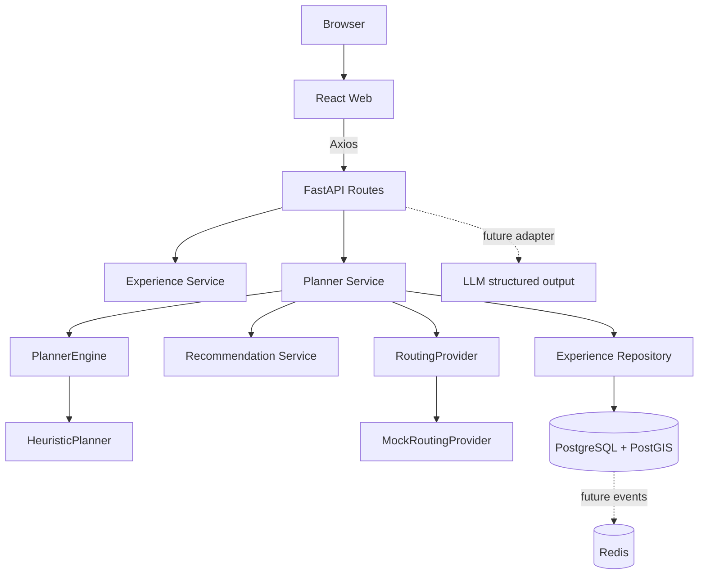

# Kiến trúc

## Thành phần

- **Web**: React + TypeScript + Vite; trang Explore, Planner, itinerary, provider prototype và About. Axios gom tại `src/api`, Leaflet chỉ nằm sau `MapAdapter`.
- **API**: FastAPI route nhận/kiểm tra request rồi ủy quyền cho service. Pydantic giữ contract và định dạng lỗi có request ID.
- **Service**: `ExperienceService`, `RecommendationService`, `PlannerService`, `ExplanationService`; Planner điều phối repository, routing và engine.
- **Planner engine**: `PlannerEngine` là interface; `HeuristicPlanner` lựa slot khả thi sớm nhất rồi ưu tiên intent khi cùng giờ. Có thể thêm engine OR-Tools mà không đổi route contract.
- **Repository**: truy vấn SQLAlchemy cho catalog và slot, tách chi tiết persistence khỏi route.
- **Database**: PostgreSQL + PostGIS; tọa độ latitude/longitude phục vụ response và `pois.geom geography(POINT,4326)`/GIST phục vụ truy vấn không gian tương lai.
- **Routing adapter**: `RoutingProvider` cùng `MockRoutingProvider`; khoảng cách/duration là ước tính tuyến thẳng nhân hệ số đường và tốc độ giả định. `is_realtime=false`.
- **Redis**: được đưa vào Compose và health check; chưa có cache, queue hoặc event consumer.
- **Map adapter**: Leaflet + OpenStreetMap trong demo. Map SDK không giữ business logic.

## Dòng lập lịch

1. Request datetime phải có offset; planner chuẩn hóa thời điểm cho so sánh/lưu UTC.
2. Lọc slot trong khoảng chuyến đi, loại slot đã hủy/hết chỗ và loại `available_reported` nhỏ hơn quy mô nhóm.
3. Tính giá theo `price_basis`, loại trải nghiệm vượt ngân sách còn lại.
4. Tính route estimate từ điểm trước đó, chỉ nhận slot bắt đầu sau thời gian đến dự kiến.
5. Engine chọn slot khả thi; lý do, mục đích được giữ/mất, tính bất định và routing mock được đưa vào response.
6. Persist itinerary, stops và DecisionLog. Slot capacity chưa biết không bị coi là 0; itinerary chuyển `tentative`.

## Ranh giới tin cậy

Mọi POI, hoạt động, giá và khung giờ do seed script tạo đều mô phỏng. Provider prototype chỉ đọc. Không có booking, authentication, xác nhận chỗ, giao thông, hay LLM production. Không hiển thị dữ liệu mô phỏng thành giao dịch thực.
