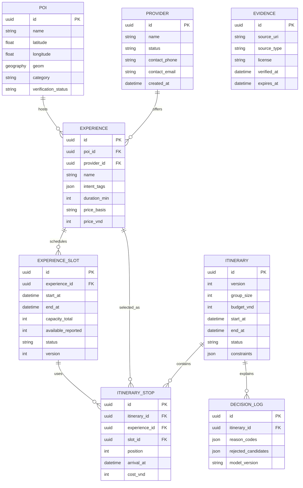

# Data model

Schema core dùng UUID dạng chuỗi, timestamp có timezone, giá VND dạng integer và status dạng chuỗi có giá trị enum dùng chung trong ứng dụng. `pois.geom` là PostGIS `geography(Point,4326)` có GIST index; API hiện dùng lat/lon, chưa có truy vấn radius.

`available_reported`: `null` = chưa xác định; `0` = hết chỗ; số dương = số chỗ báo cáo. Dữ liệu seed xen kẽ slot được báo cáo và slot tentative để UI thể hiện bất định.
