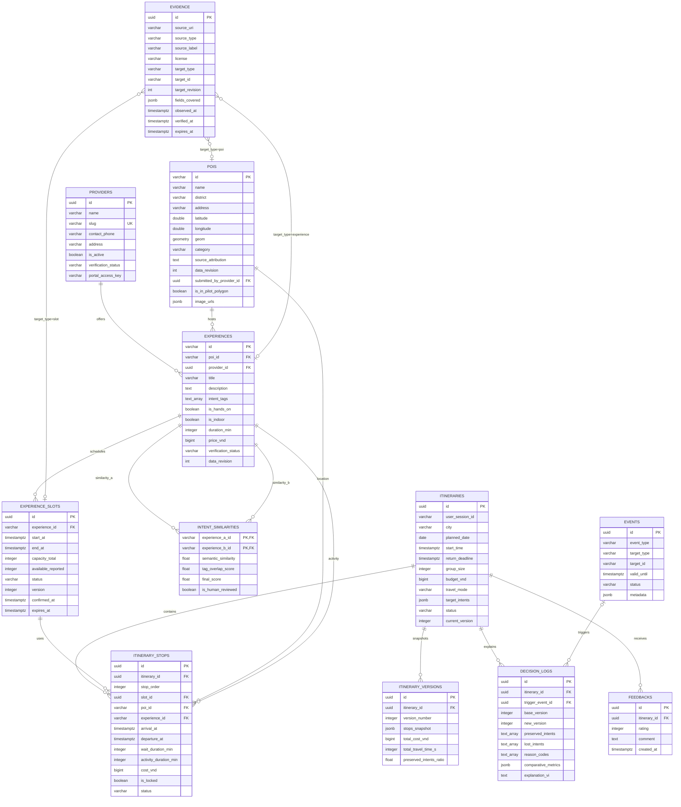

# Data model

This schema incorporates the team's PostgreSQL 15+ / PostGIS ERD. PostgreSQL uses
`text[]` for tag/reason lists, `jsonb` for documents, `bigint` for VND amounts,
and `geometry(Point, 4326)` plus a GiST index for POI locations. SQLite is used
only by the API test suite and maps the same collection fields to JSON.

`intent_similarities` stores each pair once (`experience_a_id < experience_b_id`)
and constrains all three scores to `[0, 1]`. Slot status accepts the team's
`open | full | cancelled` values; legacy `available | unavailable | tentative`
values remain supported for existing API/demo data. `feedbacks` is intentionally
minimal because the team's ERD references it but does not define its columns.

The first project schema used `name`, `indoor`, `position`, `start_at`/`end_at`,
and other fields that current API clients depend on. These columns remain as
compatibility fields alongside the team's canonical `title`, `is_indoor`,
`stop_order`, `departure_at`, and other fields. The planner writes both forms.
Identifiers remain string-backed to preserve existing UUID values while also
accepting the human-readable POI/experience IDs in the team's design.

Migration `0002_team_database_architecture` adds the missing tables and columns,
backfills existing rows, upgrades VND columns to `bigint`, converts tag/reason
lists to PostgreSQL arrays, and converts POI geography to geometry. Migration
`0001_initial` is kept as a frozen baseline so future ORM changes cannot alter
the historical migration.

Migration `0005_sourced_catalog_evidence` attaches evidence to a POI, experience,
or slot with a typed target ID, target revision, field coverage, observation
time, source, and expiry. This is a deliberate polymorphic reference; the
service validates the target and provider ownership. Editing a POI or
experience increments its revision and makes evidence for the older version
ineligible. Migration `0006_provider_poi_ownership` adds the owner pointer for
provider-submitted POIs. See [sourced catalog workflow](sourced-catalog.md).

The PRD lists 32 HCMC POI names grouped into eight areas, but does not provide
their coordinates, addresses, source attribution, provider links, activities,
or schedule data. Therefore those names are not inserted as operational POI
rows with fabricated locations. The existing seed remains explicitly synthetic;
the supplied POI catalogue can be loaded once its source data is completed and
verified. The eight named areas are represented by `pois.district` rather than
a separate region table, matching the ERD.
